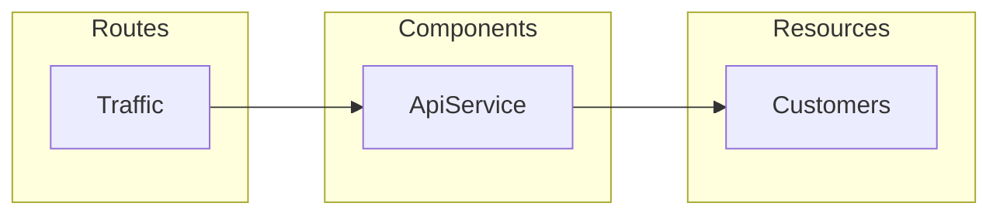

# Applications
Applications are a representation of an entire system defined in a single software repository. They store [Builds](/docs/Builds.md) of the [Source Code](/docs/Builds.md#source-code) and can host several [Environments](/docs/Environments.md).

## Linked Repositories
Applications can be linked to a Repository to integrate with it's code and events automatically. Linked Resositories connect Source Code to Builds and power [Pipelines](/docs/Pipelines.md).

## Noop Application Model
Noop offers a broad set of [Components](/docs/Components.md), [Resources](/docs/Resources.md), and other options like [Routes](/docs/Traffic.md#routing-rules) to build your Application. You define your needs in your [AppManifest](/docs/Manifests.md#appmanifest) within your code. This means that your code completely describes itself as a system, not through the intermediate levels of containers or infrastructure.

You can mix and match as many Components and Resources as you need in your Application as it grows and evolves. We strive to offer the least-opinionated building blocks possible for your to use when designing and constructing your code. Noop only has opinions to how you code when there aren't decent standards-based practices available and there is a compelling benefit to our users.

