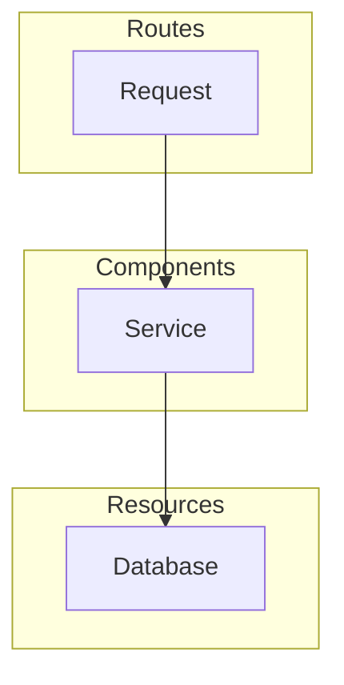

# Applications

## Noop Application Model

Noop offers a broad set of [Components](/docs/Components.md), [Resources](/docs/Resources.md), and other options to build your Application. This means that your code completely describes itself as a system, not the intermediate levels of containers or infrastructure.

We strive to offer the least-opinionated building blocks possible for your to use when designing and constructing your code. Noop only has opinions to how you code when there aren't decent standards-based practices available and there is a compelling benefit to our users.

