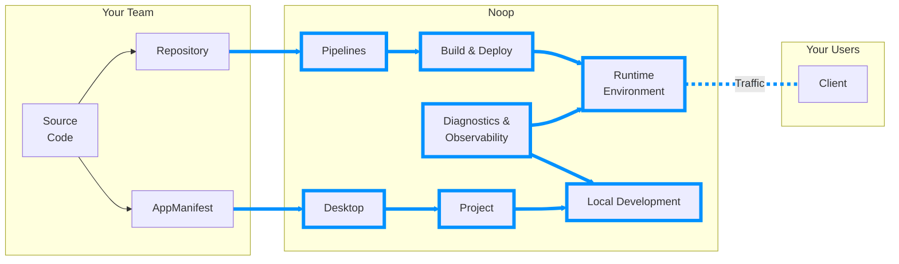

# Getting Started

## What is Noop?

[Components](/docs/Components.md)

```mermaid
flowchart LR
    subgraph Your Team
    direction TB
    Code[Source\nCode]-->Repository & AppManifest
    end
    subgraph Noop
    direction LR
    Repository-->Pipelines-->Build[Build & Deploy]-->Runtime[Runtime\nEnvironment]
    Diagnostics[Diagnostics &\nObservability]-->Runtime
    Diagnostics-->Local
    AppManifest-->Desktop-->Project-->Local[Local Development]
    end
    subgraph Your Users
    direction LR
    Runtime-. Traffic .-Client
    end
    classDef className stroke:#0091ff,stroke-width:5px;
    class Pipelines,Build,Runtime,Diagnostics,Desktop,Project,Local className;
    linkStyle 2,3,4,5,6,7,8,9 stroke:#0091ff,stroke-width:5px
    linkStyle 10 stroke:#0091ff,stroke-width:5px,stroke-dasharray: 5 5
```
