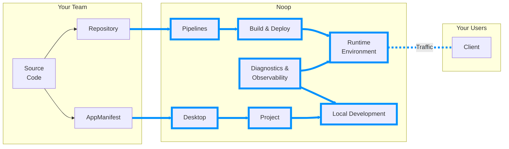

# Getting Started

## Why Noop?

Noop is an **integrated** toolchain and platform to solve the challenges that stand between **developing** your code and **delivering** it. Our integrated approach stands alone in attempting to solve this broad set of challenges and crucially understands the **context** of you applications.

## Why Not DevOps?

In DevOps, tools only attempt to address specific areas. This leaves the chalenge of selection, integration, and maintenance of each tool in the toolchain to the organizations trying to deliver software.

[Components](/docs/Components.md)

[Tasks](/docs/Components.md#tasks)

### Dummy SubSection One

hello

### Dummy SubSection Two

world

## Dummy End Section
