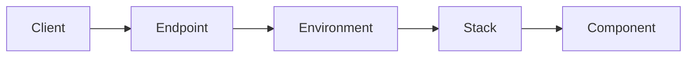

# Traffic

Noop regards HTTP Traffic routing and inspection as a core competency.

## Internet Endpoints

Secure, public Internet Endpoints that are hosted by our global routing network. Noop manages HTTPS certificates and even offers free domains to get online fast.

## Localstack

Secure, internal communication between the Components of a [Stack](/docs/Stacks.md) leveraging Routing Rules. Easily available from any Component by making HTTP requests to `http://localstack`.

## Routing Rules

Leverage [Noop Logic](/docs/Logic.md) to evaluate the request headers of a stream to decide it's target.

## Rewriting Headers

Coming Soon!
